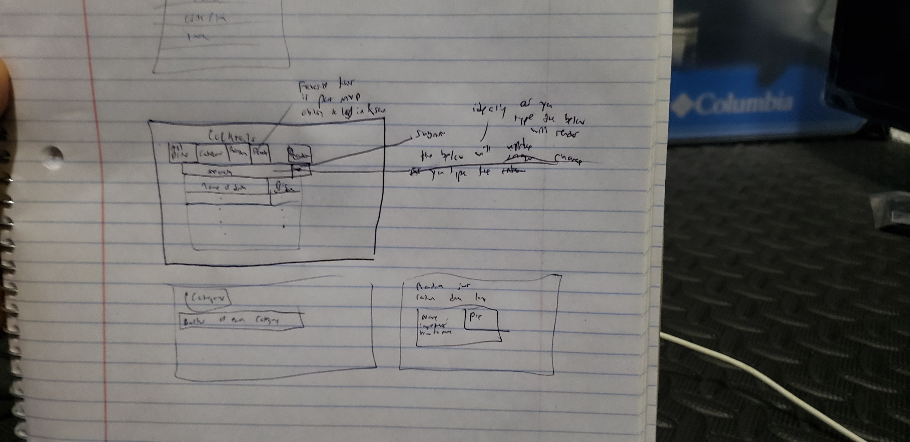
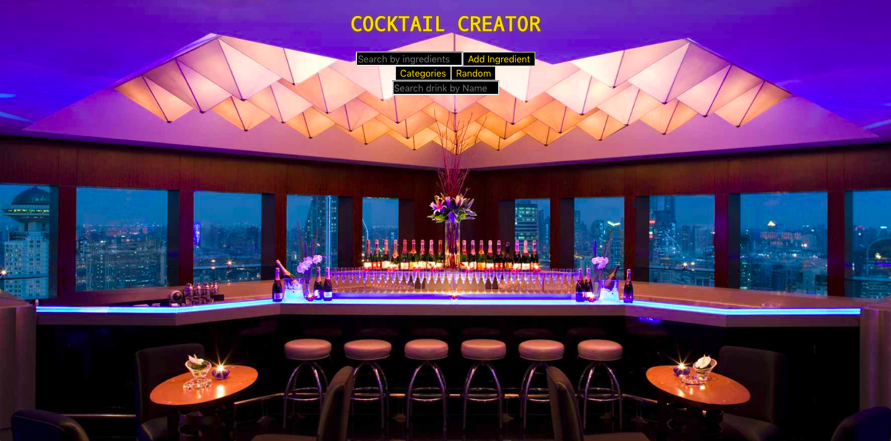
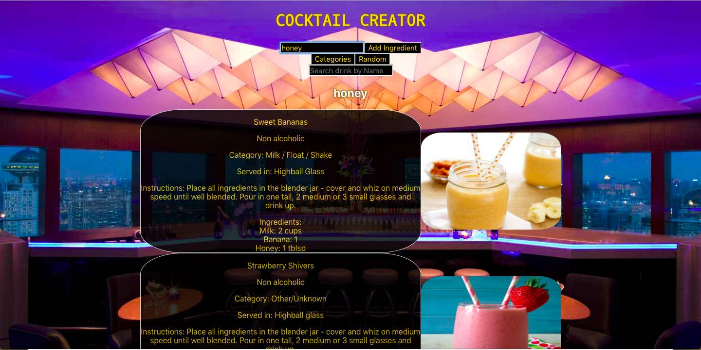
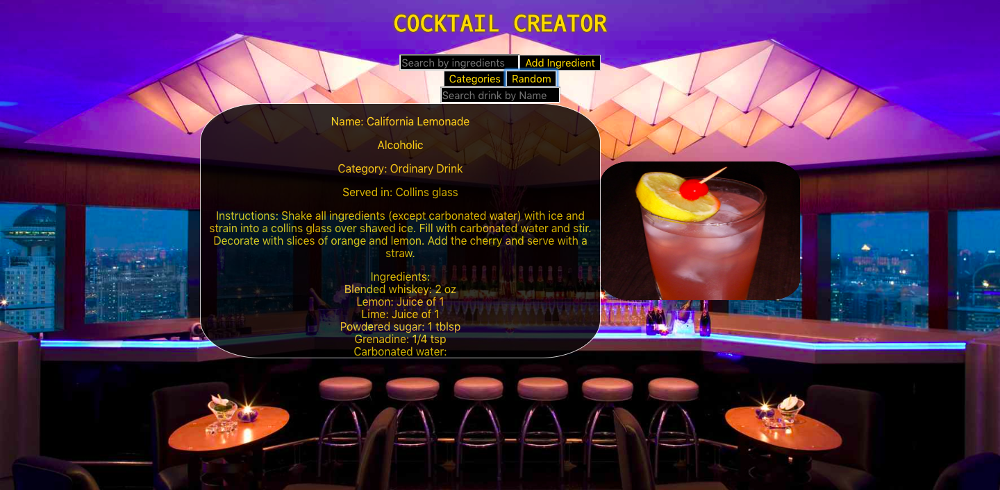
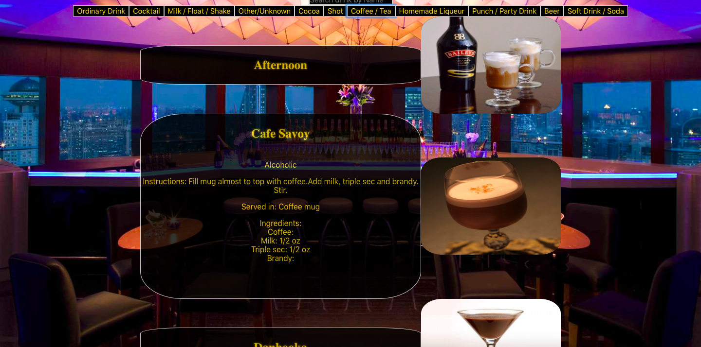
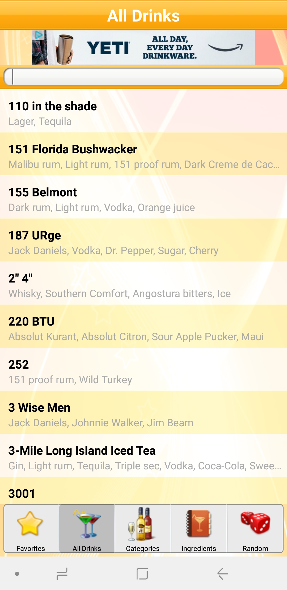

#Name: Cocktail Creator

##Synopsis:
A react created website that lets you search cocktails based on its name.
You can sort via categories--ie: beer, cocktails, shots, etc.
You can click random and it will load
-->the name of the drink
-->How to make it
-->The ingredients
-->The picture

Current Potential issues:
being able to render a different drink based on the query of search using regex conation

Sources:
It will pull data from the below api:
<https://www.thecocktaildb.com/api.php>

A current app already in marketplace, the template I'm building off of

#Youtube link to the video detailing the react project
<https://www.youtube.com/watch?v=E984y8T8Ilk&feature=youtu.be>

POST MVP
Potential goals being able to favorite a drink
-->Issue would involve some sort of login to relate it a certain individual
-->Would need to find a suitable api for login purposes

Goals to accomplish:
Tuesday get the categories button to work so upon click create more buttons
each individual button has a handler that renders all the drinks under each Category
--> need to decide if to create a separate search or keep the search as it currently is
--> aka does it let u search only through the current array of category or overall

implement ingredients in the sense of searching via ingredients

also implement a feature of clicking on a drink that will perhaps load more info of the drinks

post mvp--> implememnting some sort of way to favorite or perhaps a ranking system to vote for drinks based on what u like

Website is hosted on
<https://cocktail_creator.surge.sh/>
